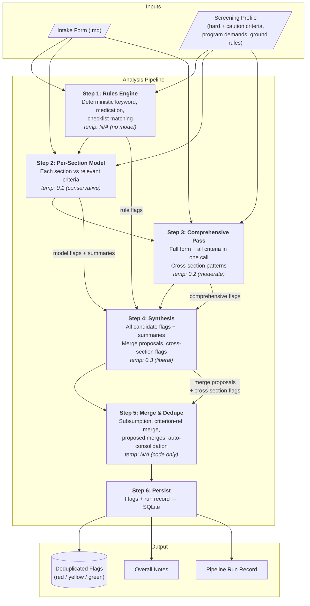
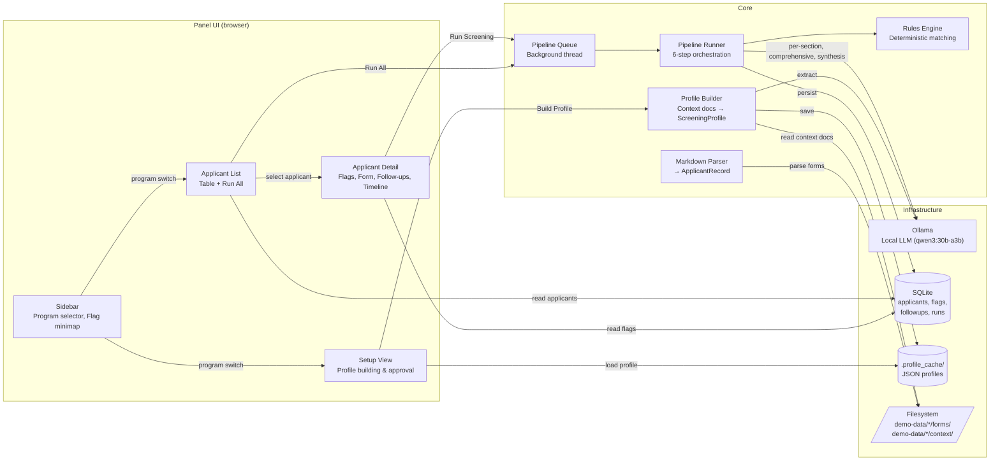
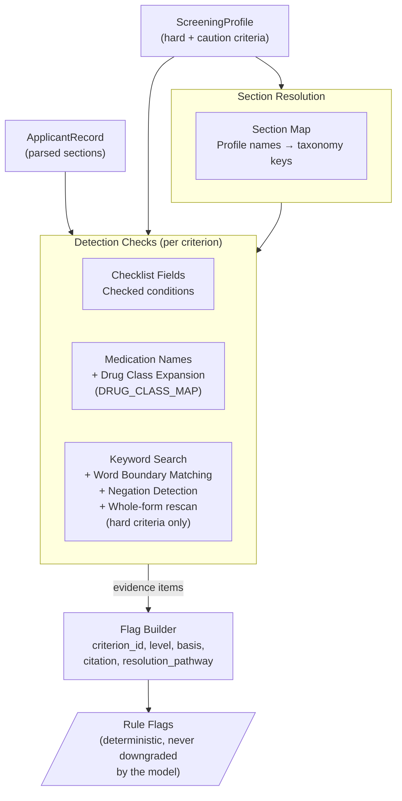
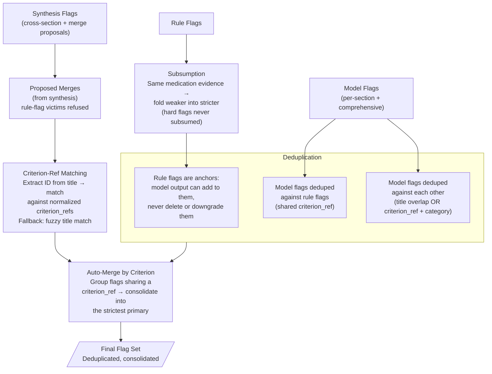
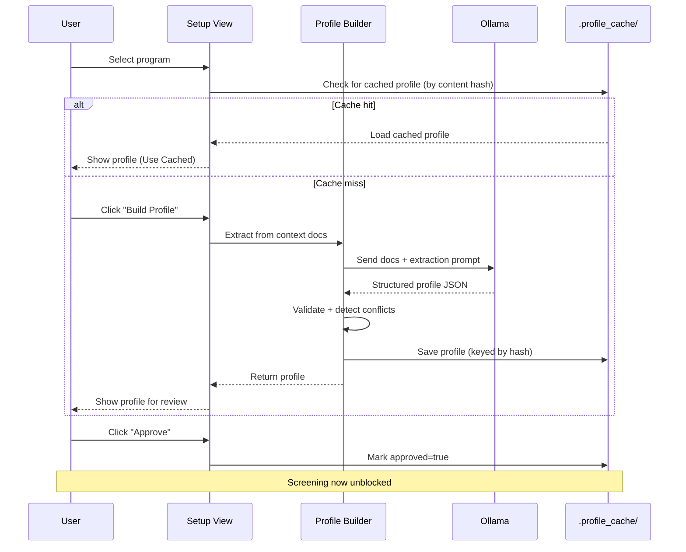
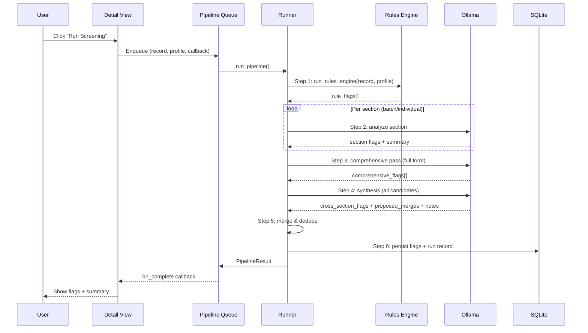

# PISA Architecture

Visual overview of the system's data flow and component relationships.

PISA is an unvalidated prototype and must not be used to screen anyone. The diagrams below describe how the code is wired, not verified behavior; see [README.md](README.md#status-and-scope).

---

## Pipeline Flow

The screening pipeline processes one applicant at a time through 6 sequential steps. The rules engine is deterministic and model-independent; steps 2-4 use the local LLM with progressively increasing temperature.

---

## System Architecture

---

## Rules Engine Detail

The deterministic layer matches what the profile spelled out, without model involvement. Its recall is bounded by the profile's keyword and medication lists, so this is a floor on model variance rather than a completeness claim.

---

## Merge & Deduplication Flow

Step 5 consolidates flags from all sources into a non-redundant set. Every consolidation path uses one comparator, `_strictness_key`, which ranks a hard flag above any soft flag, then level, then severity. Consolidation may raise a flag's severity and never lowers it.

Three invariants hold across this step, each covered by tests in `tests/test_pipeline.py`:

1. A rule flag is never deleted by model output. A synthesis merge proposal naming a rule flag as a victim is refused and logged.
2. `hard_flag` propagates on merge and is never lost, and a hard flag never acquires `resolution_criteria`. That is what keeps an unresolvable exclusion from turning into a resolvable red.
3. `basis` and `citation` are never inherited across criteria, since they describe the criterion that produced the flag.

---

## Profile Lifecycle

---

## Data Flow During Screening

