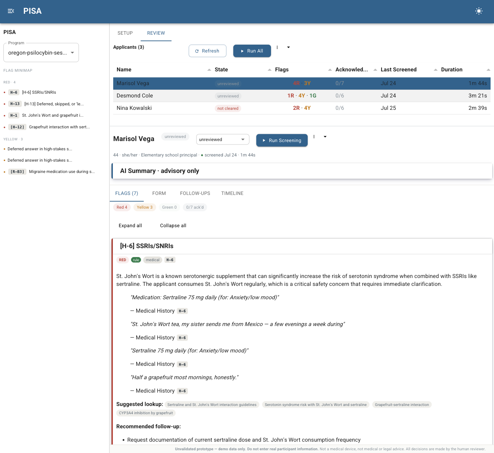

# PISA — Participant Intake Screening Assistant

A prototype for thinking through what a participant safety screening assistant could look like if an LLM helped a human reviewer without ever deciding anything. Built with HoloViz Panel and panel-material-ui, running local inference through Ollama.

An LLM is useful here because it can notice a psychiatric history disclosed in a narrative three pages after the applicant answered "No" to the direct question. It is dangerous here because the same model will confidently apply the wrong jurisdiction's rule, or talk itself out of a contraindication the applicant framed sympathetically.

**Which parts of this job can a machine hold, which parts must stay with the person, and how do you build the seam between them so the reviewer can tell what they are looking at?** The answers this repo tries out:

- **Criteria live in documents, not code or model weights.** A program's own screening criteria are read and turned into a structured profile that a human inspects and approves before any screening runs. The reviewer signs off on the interpretation as well as the output.
- **Anything statable is stated, and matched deterministically.** A rules engine fires on explicit keywords, medications, and checklist fields, so those matches don't depend on temperature or phrasing. The model layers on top for what keyword matching cannot reach.
- **The model can add, never subtract.** Model output cannot delete a deterministic flag, downgrade its severity, or attach a resolution pathway to an exclusion. Consolidating flags can raise severity and never lowers it.
- **Every flag shows its provenance and basis**, so a reviewer sees whether a flag came from a rule or a model, and whether "cannot proceed" is law or house policy. Calibrating trust requires knowing which is which.
- **The reviewer decides.** Nothing in the system emits an accept or reject, and no prompt is allowed to recommend one.

The load-bearing test case is a fact that resolves in opposite directions: "this person takes lithium" is a categorical exclusion under one program's rules and a resolvable clearance pathway under another's. A tool that hard-codes either answer is wrong half the time, and a tool that asks the model to remember which state is which is unreliable. Two demo datasets encode the disagreement, and the eval checks that the same medication comes out hard in one and resolvable in the other.

## Status and scope

**This is an unvalidated prototype. Do not use it to screen anyone.**

- Not a medical device, not clinical decision support, not medical or legal advice.
- Never validated, audited, or reviewed by a clinician, regulator, or lawyer.
- No authentication, no encryption at rest (plain SQLite), no access controls, no audit log of who viewed which record, no retention or deletion path, no consent handling. `pixi run app` serves with `--dev`.
- **Do not enter real participant information.** Every applicant, organization, and program in `demo-data/` and `tests/fixtures/` is fabricated.
- The screening criteria documents paraphrase OAR 333-333 and 4 CCR 755-1 as an exercise. They are not accurate legal summaries, both states are still amending their rules, and nothing here substitutes for counsel.
- Not for use in any eligibility, screening, hiring, admission, or clinical decision about any person.

Published as a design study. What it contains is the seam between the deterministic layer, the model, and the reviewer, plus the demo datasets and prompts that pin that seam down. Treat it as something to read, not to deploy or build on.

Known gaps are in [IMPLEMENTATION.md](IMPLEMENTATION.md#known-gaps).

## What it looks like



The Review tab, with a fabricated applicant from the Oregon demo dataset. On the expanded flag card, `RED` is the level, `rule` is the provenance so the reviewer knows this one came from deterministic matching rather than the model, `medical` is the category, and `H-6` is the criterion that fired. Under the rationale, every claim is anchored to a verbatim quote from the form with the section it came from, because a reviewer cannot check a flag they cannot trace. Suggested lookups and follow-up questions are proposals for the reviewer, not actions the system takes.

The left rail is a flag minimap grouped by severity, so a long form does not bury a red. The applicant list carries review state, flag counts, and how many flags have been acknowledged. Nothing anywhere emits an accept or reject.

Flags in this screenshot were generated by an earlier revision of the pipeline, so it illustrates the interface rather than current output.

## Quick Start

```bash
ollama pull qwen3:30b-a3b
pixi install
pixi run app
```

Opens at `localhost:5006`. Go to Setup, build a profile, approve it, then switch to Review and run screening against the fabricated demo applicants.

## Requirements

- macOS/Linux with 32 GB RAM for the 30B model (16 GB works with `qwen3:14b`)
- Ollama running locally
- pixi for environment management

## How It Works

1. **Context documents** (program description, screening criteria) are analyzed to extract a Screening Profile
2. **Intake forms** (markdown) are parsed into structured records
3. A **6-step analysis pipeline** screens each applicant:
   - **Rules engine** — deterministic keyword, medication, and checklist matching, no model
   - **Per-section model analysis** — each form section reviewed against relevant criteria (temp 0.1)
   - **Comprehensive whole-form pass** — entire form plus all criteria in one model call for cross-section patterns (temp 0.2)
   - **Synthesis** — correlates all candidate flags, proposes merges, detects contradictions (temp 0.3)
   - **Merge & deduplicate** — criterion-ref based consolidation, subsumption, auto-merge
   - **Persist** — flags and run record saved to SQLite
4. Results are presented as prioritized flags for a human reviewer, who makes every decision

Inference stays on the machine. No network calls beyond localhost Ollama. That covers where the text goes, not the storage and access-control work a real deployment would need; see [DESIGN.md](DESIGN.md#why-local-inference-and-what-that-does-not-cover).

## Programs

Four fabricated demo programs, each with context documents, intake forms, and a test oracle:

- **summit-series** and **psilocybin-group-retreat** — invented centers with their own criteria, no regulatory layer
- **oregon-psilocybin-session** — an Oregon-style regulatory floor plus house standards, at a fictional center
- **colorado-psilocybin-session** — a Colorado-style clearance-pathway model, at a fictional center

The two state programs exercise the **regulatory vs house** distinction: each criterion carries a `basis` (regulatory or house) and a `citation`. In the Oregon dataset the lithium criterion is exclusionary; in the Colorado dataset it is the strictest clearance tier, red but resolvable through a documented pathway. The point of the pair is that the engine follows each program's documents rather than collapsing them into one rule. See [demo-data/README.md](demo-data/README.md).

## Project Structure

```
pisa/           # Application code (app, pipeline, parser, UI, store)
prompts/        # Versioned prompt templates
demo-data/      # Fabricated programs with context docs and intake forms
scripts/        # Evaluation and seeding utilities
tests/          # pytest suite and parser fixtures
```

See [ARCHITECTURE.md](ARCHITECTURE.md) for diagrams, [IMPLEMENTATION.md](IMPLEMENTATION.md) for technical details, [DESIGN.md](DESIGN.md) for rationale, and [USER_GUIDE.md](USER_GUIDE.md) for usage.

## License

BSD 3-Clause, in [LICENSE](LICENSE). [NOTICE.md](NOTICE.md) records the intended use: a research prototype, not for any real screening decision.
